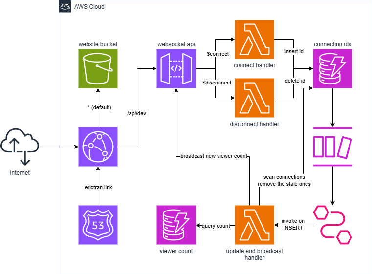

# [cloud resume challenge - my attempt](https://erictran.link)

This is my attempt of [The Cloud Resume Challenge](https://cloudresumechallenge.dev/docs/the-challenge/aws/), utilizing AWS services to deploy a globally available, scalable, and cost-effective digital resume. CI/CD pipelines are integrated to automate deployments of the frontend and Terraform infrastructure.

You can find the latest deployment here: [erictran.link](https://erictran.link),
or you can just click on the header of this readme.

## architecture

## implementation details

### 1. static website hosting

Frontend is developed using **React**, and all build artifacts are stored in **S3**.

All contents in S3 are delivered using **CloudFront** with Origin Access Control (OAC).

Custom domain is provided by **Route 53**, resolving to the CloudFront distribution.

### 2. real-time viewer count tracking

WebSocket API is created using **API Gateway** and delivered using CloudFront.

All new connections/disconnections are triggered by their respective **Lambda** functions.
- New connections add a unique *connectionId* to a **DynamoDB** table `viewer-count-connection-ids`,
- and vice-versa for new disconnections.

All changes to `viewer-count-connection-ids` trigger an **EventBridge pipe**.
- Source: DynamoDB stream of this table
- Filter: INSERT events only - i.e. new connections
- Target: Lambda function

This Lambda function increments the viewer count stored in a DynamoDB table `viewer-count`, removes stale WebSocket connections, and broadcasts the new viewer count to all active connections.

One caveat: all connections are closed after 2 hours, which is probably okay considering no one is likely going to be on the site for that long

### 3. infrastructure as code

All AWS resources are managed by **Terraform**. Frontend and backend resources are separated in their own modules.

### 4. ci/cd

Changes to the frontend and infrastructure are re-deployed using **GitHub Actions**.

## possible expansions

- Monitoring using CloudWatch - maybe Lambda error rates? as well as CF, APIGW